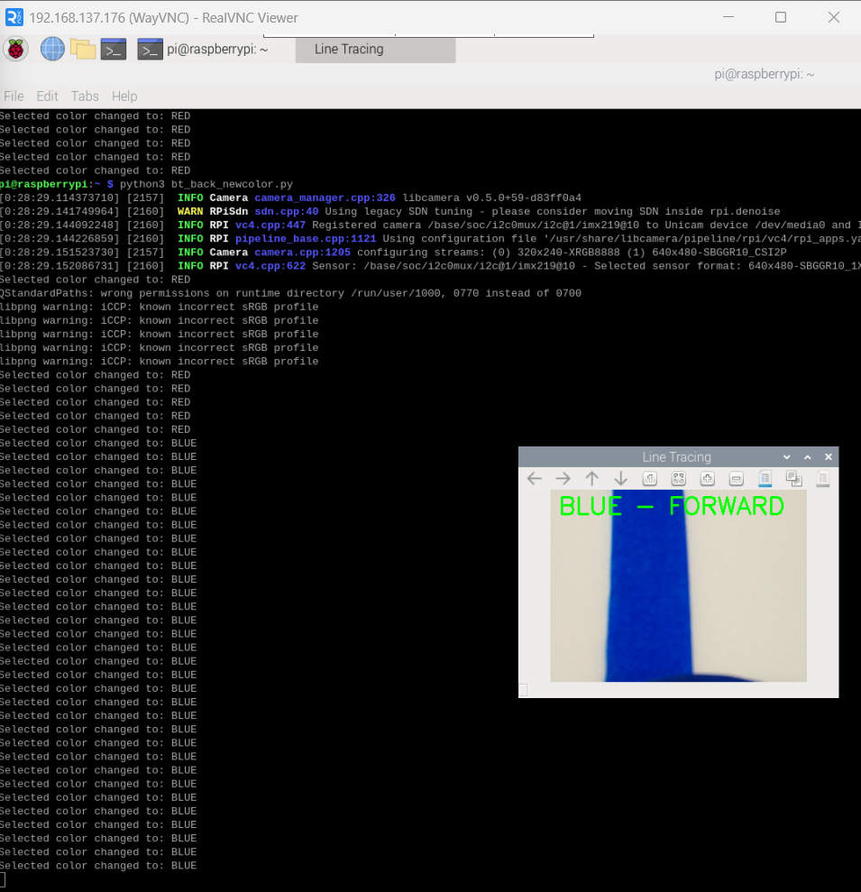

# Line Tracing Wheelchair

## Project Overview
This project implements a line-tracing autonomous wheelchair using Arduino UNO and Raspberry Pi.  
This wheelchair is a multifunctional system designed to help patients living in hospital wards move and perform daily activities independently without the assistance of caregivers.  
The Raspberry Pi processes camera images with OpenCV to detect colored lines and determine the driving direction.  
The direction commands are sent to Arduino via serial communication to control the motors.

## Hardware
- Raspberry Pi
- Pi Camera v2
- Arduino UNO
- Motor Driver
- DC Motors
- Ultrasonic sensor (Distance measurement)
- Light sensor (Darkness detection)
- Pressure sensor (Fall detection / Touch input)
- Buttons (Direction selection)
  
## Software
- Python (OpenCV, Picamera2, Numpy, Pyserial)
- Arduino IDE

## System Architecture
Raspberry Pi :
- Capture image
- Convert to HSV
- Detect color line
- Recieve selected color
- Calculate direction (LEFT, RIGHT, FORWARD, BACK)
- Send command to Arduino

Arduino :
- Detect selected color line by buttons
- Receive serial command
- Control motors (LEFT, RIGHT, FORWARD, BACK)

## Features

- Line tracing with Raspberry Pi camera and OpenCV
- Obstacle detection using ultrasonic sensors
- Automatic light activation in dark environments via light sensor
- Fall detection using pressure sensor
- User-controlled movement via buttons
- Real-time communication between Raspberry Pi and Arduino for motor control

## How to Run
1. Upload Arduino code to the Arduino UNO board : arduino/linetracing_wheelchair.ino
2. Connect Arduino to Raspberry Pi via USB
3. On Raspberry Pi, install required Python packages : pip3 install opencv-python picamera2 numpy pyserial
4. Run the Raspberry Pi main program : python3 raspberry_pi/linetr_whchair.py
5. Use the buttons to control the wheelchair manually
6. Press 'q' to stop the program
